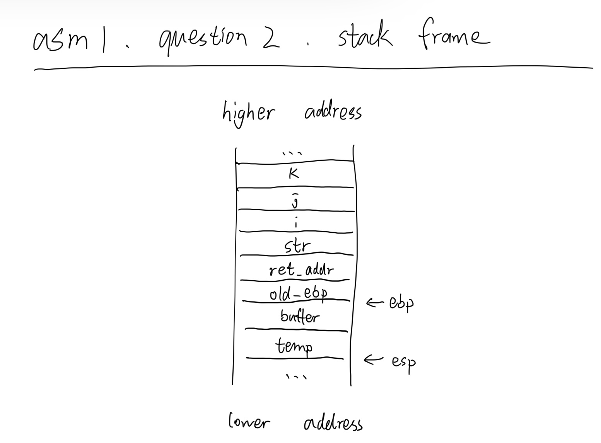

# IERG4130 Assignment 1
## YU Sihong
## 1155141630

### Q1
&emsp;a: initialized data segment

&emsp;str, b, c, d, buf: stack

&emsp;ptr: heap

### Q2


### Q3
&emsp;no; 
- As size_t is unsigned type, if len is a negative number, it will pass the if condition but copy a very long sring in memcpy, i.e. -1 will become 4294967295.
- If len is 64, it is dangerous that buf is full and do not end with a ending symbol i.e. '\0'. It will continue to read other thing in the stack in the memory when using other function call like printf.
- A possible modification:
    ```c
    void func(char *data, unsigned int len)
    {
        char buf[65];
        if (len > 64)
            return;
        memcpy(buf, data, len);
    }
    ``` 

### Q4
The string should be long enough to reach the address of return address, and followed by the address of my code. Assume the length of return address is 4 bytes, and the address of my code is 0x41414141 (hex of 'AAAA'), thus the string can be 'A...AAAAA' (52(16*3+4) A's in total).

### Q5
1) To write too much things into the limited size of a variable in stack or heap frame without boundary checking, result in overwriting other components.

2) The variables with higher address than the local variable in which you launch the attack, usually are incoming parameters, return address and saved eip.

3) 
- a. 1.Low efficiency to detect random address attack. 2.Malicious software may be able to detect and do not overwrite the canary so that it won't work.

- b. 1.Cannot detect or reprot attack. 2.Not able to control the executable code in meomory already, which malicious software can take advantage of.

- c. 1.Cannot detect or reprot attack. 2.Malicious software is still able to attack and find the real address from the random address.


### Q6
In this way, the overflow will reach the stack frame of caller function, i.e. the large string in bar() function will be able to overwrite the components in foo() function. If there is a overflow, there will be a risk to be taken advantages of. The better idea is to write more secure code and utilize defense techniques.