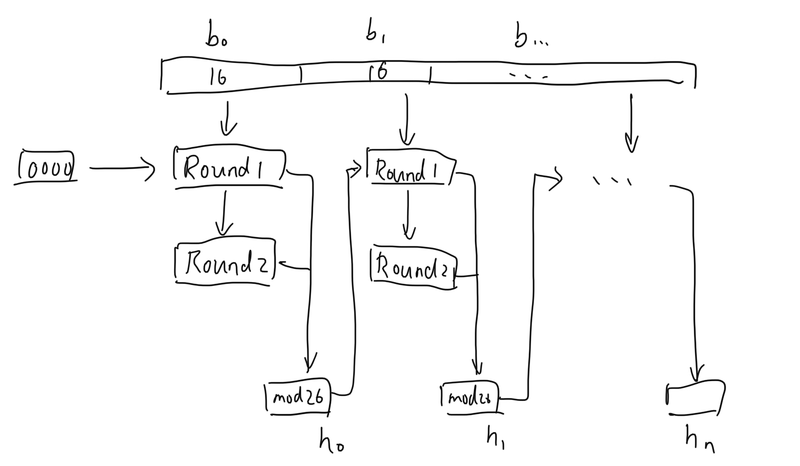
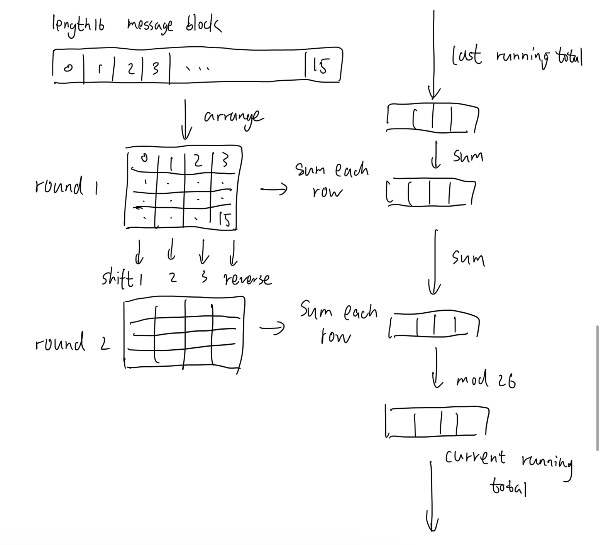

# IERG4130 Assignment 2
## YU Sihong
## 1155141630

### Q1
1.  
- Stream cipher: ChaCha, RC4; 
- Block cipher: Twofish, Rijndael.

2.  
- Stream cipher: 
-- use PRNG to generate key, 
-- use XOR to encrypt and decrypt, 
-- process bytes by bytes; 
- Block cipher: 
-- generate ley by dedicateed process, 
-- having multiple operations like rotation to encrypt and decrypt, 
-- shifting, process block by block.


### Q2
(assume shift right, that with key 1, 'a' will shift to 'b')
1. byntbimwn
2. 18,0,4,13,9,9,25,13,11,19,24,10,10

### Q3
- M = [1,1,3,7]
- steps are as follow.
```
1. first to generate sbox S:
inilialize sbox by S[i]=i, having
    S=[0,1,2,3].

2. then, update by secret 96, steps are as follows.
    i=0
    j=0
    i=0
    j=(0+0+9) mod 4=1
    S=[1,0,2,3]
    i=1
    j=(1+0+6) mod 4=3
    S=[1,3,2,0]
    i=2
    j=(3+2+9) mod 4=2
    S=[1,3,2,0]
    i=3
    j=(2+0+6) mod 4=0
    S=[0,3,2,1].

3. then, decryption C=[1,2,3,4], steps are as follows.
    i=0
    j=0
    i=1
    j=(0+3) mod 4=3
    S=[0,1,2,3]
    t=(1+3) mod 4=0
    M[0]=C[0] XOR S[0]=1 XOR 0=1
    i=2
    j=(3+2) mod 4=1
    S=[0,2,1,3]
    t=(2+1) mod 4=3
    M[1]=C[1] XOR S[3]=2 XOR 3=1
    i=3
    j=(1+3) mod 4=0
    S=[3,2,1,0]
    t=(0+3) mod 4=3
    M[2]=C[2] XOR S[3]=3 XOR 0=3
    i=0
    j=(0+3) mod 4=3
    S=[0,2,1,3]
    t=(0+3) mod 4=3
    M[3]=C[3] XOR S[3]=4 XOR 3=7

4. finally get M=[1,1,3,7]
```

### Q4
1. RSA is based on discrete logarithm problem, so that its security depended on the assumption that there is no efficient algorithm for solving it.

2. CA can ensure the Authenticity and Non-repudiation of the digital signatures. Without a CA, even the malicious can generate the signature and it is not able to distinguish.

### Q5
1. a possible M is 4 such that 4^5 mod 35 = 9.
- steps are as follow.
```
trying brute force, as 9=M^5 mod 35:
M: 1
M^5 mod 35: 1
M: 2
M^5 mod 35: 32
M: 3
M^5 mod 35: 33
M: 4
M^5 mod 35: 9
```

2. NO, as n=33 can only be divided into 3*11, so z can only be 20, but it is not relatively prime with e=5, which does not fulfill the requirement of a RSA system. And there is no d such that 5*d mod 20 = 1.

### Q6
1. note that 7 = 2 ^ x mod 11, a possible x is 7.
```
2^1 mod 11 is 2
2^2 mod 11 is 4
2^3 mod 11 is 8
2^4 mod 11 is 5
2^5 mod 11 is 10
2^6 mod 11 is 9
2^7 mod 11 is 7
```

2. shared key is 4^7 mod 11 = 5.

### Q7
3. 
- issuer: Let's Encrypt; 
- public key: 2048 bit RSA Public-Key.

### Q8
1.
- provide security properties
- if the hash function has no key, the attackers can just modify the message and generate the codes on their own and the receiver can not distinguish that. Whereas hashing with a key can avoid attackers to modify if they do not know the key.

2. 
- first is symmetric encryption and then an error control code.
- as ecc protect the integrity when sending, and the encrypted message is the actual message to be sent.

### Q9
1. 
- the overall figure


- the function figure


2.
- F,G,S,P
- steps are as follow.
```
block 0, round 1 
19,7,8,18 
8,18,0,13 
0,18,18,8 
6,13,12,4 
running total is 0,13,18,9 
block 0, round 2 
8,18,12,4 
0,13,8,8 
6,7,0,13 
19,18,18,18 
running total is 16,16,18,4 
block 1, round 1 
13,19,5,14 
17,8,13,19 
17,14,3,20 
2,19,8,14 
running total is 15,21,20,21 
block 1, round 2 
17,14,8,14 
17,19,5,20 
2,19,13,19 
13,8,3,14 
running total is 16,4,21,7 
block 2, round 1 
13,19,14,2 
24,1,4,17 
18,4,2,20 
17,8,19,24 
running total is 12,24,13,23 
block 2, round 2 
24,4,19,24 
18,8,14,20 
17,19,4,17 
13,1,2,2 
running total is 5,6,18,15 
result in alphabet is F,G,S,P 
```

3. 
- a string as follow can make it.
```
AAAA
EAAA
CBAA
PAAA
AAAAAAAAAAAAAAAA
AAAAAAAAAAAAAAAA
```
- steps are as follow.
```
block 0, round 1 
0,0,0,0 
4,0,0,0 
2,1,0,0 
15,0,0,0 
running total is 0,4,3,15 
block 0, round 2 
4,1,0,0 
2,0,0,0 
15,0,0,0 
0,0,0,0 
running total is 5,6,18,15 
result in alphabet is F,G,S,P
```