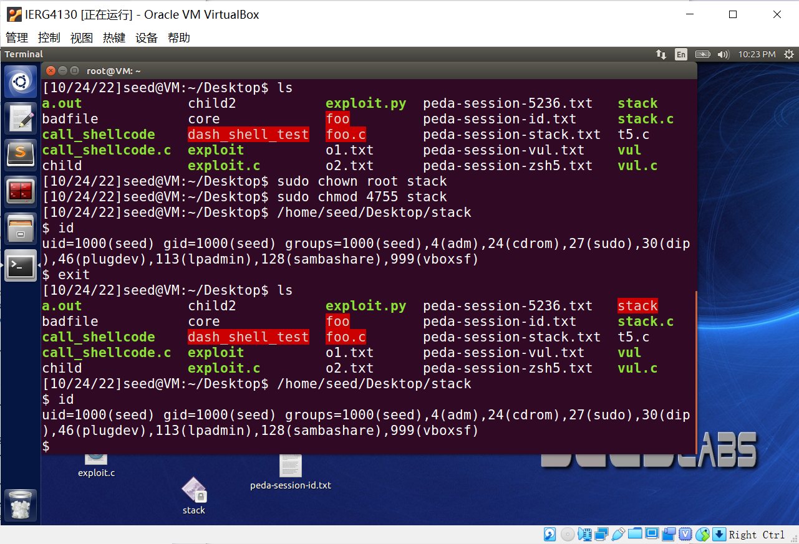
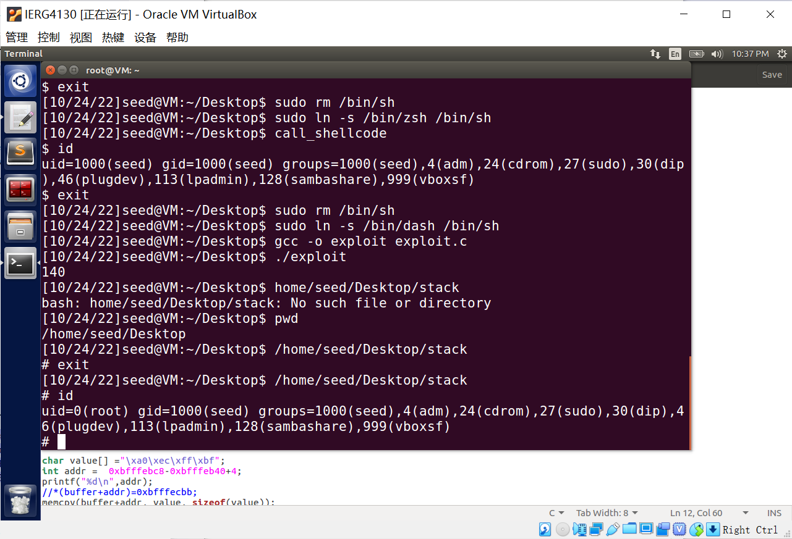

```
* IERG 4130 
* Lab 1

* I declare that the assignment here submitted is original
* except for source material explicitly acknowledged,
* and that the same or closely related material has not been
* previously submitted for another course.
* I also acknowledge that I am aware of University policy and
* regulations on honesty in academic work, and of the disciplinary
* guidelines and procedures applicable to breaches of such
* policy and regulations, as contained in the website.
*
* University Guideline on Academic Honesty:
*   http://www.cuhk.edu.hk/policy/academichonesty
* Faculty of Engineering Guidelines to Academic Honesty:
*   https://www.erg.cuhk.edu.hk/erg/AcademicHonesty

* Student Name: YU Sihong
* Student ID  : 1155141630
* Date        : 2022/10/16
```

# task 1
Not all. In the output of the Set-UID program, the ```"LD_LIBRARY_PATH"``` variable is disappear!

- ```o1.txt``` is the output of normal ```foo.c``` function, whereas ```o2.txt``` is the set-uid one, and the use ```diff``` to find the difference.


# task 2
If the ping is not a Set-UID program or has no the capability, it cannot run properly (```operation not permitted```). After setting the capability, even though it is not a Set-UID program, it can run properly (```64 bytes ...```).

- Details are as follow.


# task 3
Compile and run the program
- It shows some warning when compiling. When runing, it calls ```/bin/sh```, the user is ```seed```. The details are as follow.


# task 4
After writing the return address and the shellcode into the badfile, overflow can be launched in stack program, code and result are as follow.

- The code inside ```exploit.c``` is as follow. Firstly find the ```return address``` related with the address of ```buffer``` using ```gdb```, which is ```0xbfffebc8-0xbfffeb40+4``` = 140. Then change the return address to somewhere inside this stack frame and before the address of shellcode, which is ```xbfffeca0```. Finally put the shellcode in the tail of ```badfile```.

- After running ```exploit```, running ```stack``` will successfully call ```/bin/zsh```.


# task 5
After commented, the user is ```seed``` the terminal signal is ```"$"```. If uncommented, the user is ```root``` and the signal becomes ```"#"```.

- Commented.

- Uncommented.


- Yes, it can get the ```root```.


# task 6
- After setting ```randomization```, running stack will cause error.


- By brute force, it will launch attack eventually. 


# task 7
After turning on the stack guard, it is able to detect the attack and return error(```stack smashing detected```) as follow.
- Details are as follow.


# task 8
After turning on non-executable stack, it return a ```segment fault``` error. It denies program to run the newly added shellcode directly. The attack can be launched only if the program return to another running stack, which is more difficult than just run the shellcode somewhere after the current stack.
- Details are as follow.


<!-- # 3.2.1
 -->

# task 9
- Q1. After vestigating the gdb, the result are as follow.  
(1) ```0xbfffece8```

(2) ```0xbfffed04``` (3) ```0xbfffed08```


- Q2 The distance is 32 bytes.  
```0xd08-0xce8= 32 ```


# task 10
- Input the string containing ```"%s"``` will make it crash.


# task 11
- Input the ```"%x"``` will get some secrets from stack.


# task 12
```"%n"``` can change the variable inside the stack according to the printed string length. With the help of 5 "%x"s, "%n" is able to reach var. Adding (```0x22112211-0x2c```) ```571548133``` "0"s to the input string makes it possible to change var to ```0x22112211```. The screenshots are as follows.

- Origin is ```0x2c```.

- Modify one ```"%x"``` into ```"%.571548141x"```, because without this notation, ```"%x"``` has already printed ```8``` bytes, so set to ```571548141``` can print ```571548133``` "0"s.

- Finally get ```0x22112211```.
